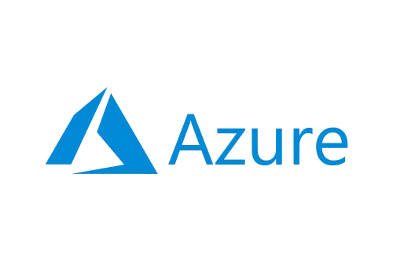

# ☁️ Cloud Cost Pre-Mortem Agent

<div align="center">




**Terraform FinOps Agent - Stop Cloud Bill Shock Before Deployment**

[](https://nodejs.org/)
[](https://reactjs.org/)
[](https://www.typescriptlang.org/)
[](https://vitejs.dev/)
[](LICENSE)

</div>

---

## 📖 Overview

**Cloud Cost Pre-Mortem Agent** is an intelligent FinOps tool that analyzes your Terraform configuration files and provides instant cost estimates for AWS, Azure, and GCP resources **before** you deploy. Get AI-powered optimization recommendations and avoid unexpected cloud bills.

### ✨ Key Features

- 🚀 **Instant Parsing** - Locally extracts and analyzes Terraform resources
- 💰 **Cost Estimation** - Real-time monthly cost preview for multi-cloud infrastructure
- 🤖 **AI-Powered Audit** - Gemini AI provides optimization suggestions and cost-saving recommendations
- ☁️ **Multi-Cloud Support** - AWS, Azure, and GCP resource pricing
- 🎯 **Provider Filtering** - View costs by specific cloud provider
- 📊 **Detailed Breakdown** - Resource-level cost analysis with instance types and regions
- ⚡ **No Deployment Required** - Analyze costs before any infrastructure is created

---

## 🏗️ Architecture

```
cloud-cost-pre-mortem-agent/
├── components/
│   ├── AiAdvisor.tsx        # AI-powered cost optimization advisor
│   ├── CostTable.tsx         # Resource cost breakdown table
│   └── FileUpload.tsx        # Terraform file upload component
├── services/
│   ├── geminiService.ts      # Google Gemini AI integration
│   ├── parserService.ts      # Terraform file parser
│   └── pricingService.ts     # Multi-cloud pricing engine
├── App.tsx                   # Main application component
├── types.ts                  # TypeScript type definitions
├── constants.ts              # Pricing constants for AWS/Azure/GCP
└── vite.config.ts           # Vite configuration
```

---

## 🚀 Getting Started

### Prerequisites

- **Node.js** 18 or higher
- **npm** or **yarn**
- **Gemini API Key** (Get it from [Google AI Studio](https://ai.google.dev/))

### Installation

1. **Clone the repository:**
   ```bash
   git clone https://github.com/YOGARATHNAM-S/cloud-cost-pre-mortem-agent.git
   cd cloud-cost-pre-mortem-agent
   ```

2. **Install dependencies:**
   ```bash
   npm install
   ```

3. **Configure API Key:**
   
   Create or edit `.env.local` file in the root directory:
   ```env
   VITE_GEMINI_API_KEY=your_gemini_api_key_here
   ```

4. **Run the development server:**
   ```bash
   npm run dev
   ```

5. **Open your browser:**
   
   Navigate to `http://localhost:5173`

---

## 📋 Usage

1. **Upload Terraform File**
   - Click the upload area or drag-and-drop your `main.tf` file
   - The app supports standard Terraform HCL syntax

2. **View Cost Analysis**
   - Instant parsing of resources (EC2, S3, RDS, etc.)
   - Total monthly cost estimate
   - Resource count by provider

3. **Filter by Provider**
   - Use the filter buttons to view costs for specific cloud providers
   - Options: All Clouds, AWS, Azure, GCP

4. **Get AI Recommendations**
   - Click "Analyze with AI" in the AI Advisor panel
   - Receive optimization suggestions and cost-saving tips
   - Get security and performance recommendations

5. **Edit and Reanalyze**
   - Modify the Terraform code in the preview section
   - Costs update automatically

---

## 🛠️ Technology Stack

| Technology | Purpose |
|------------|---------|
| **React 19.2** | UI framework |
| **TypeScript 5.8** | Type-safe development |
| **Vite 6.2** | Build tool and dev server |
| **Tailwind CSS** | Styling (via inline classes) |
| **Lucide React** | Icon library |
| **Google Gemini AI** | AI-powered cost optimization |

---

## 💡 Supported Resources

### AWS
- EC2 Instances (t2, t3, m5, c5, r5 families)
- S3 Storage
- RDS Databases (MySQL, PostgreSQL)
- Lambda Functions
- EBS Volumes

### Azure
- Virtual Machines (B, D, E series)
- Storage Accounts
- SQL Databases
- App Services
- Managed Disks

### GCP
- Compute Engine (n1, n2, e2 machine types)
- Cloud Storage
- Cloud SQL
- Cloud Functions
- Persistent Disks

---

## 🎯 Roadmap

- [ ] Support for more cloud providers (Oracle Cloud, IBM Cloud)
- [ ] Export cost reports to PDF/CSV
- [ ] Historical cost tracking
- [ ] Budget alerts and thresholds
- [ ] Terraform module library with pre-calculated costs
- [ ] CI/CD integration (GitHub Actions, GitLab CI)
- [ ] Cost comparison scenarios ("what-if" analysis)

---

## 🤝 Contributing

Contributions are welcome! Please follow these steps:

1. Fork the repository
2. Create a feature branch (`git checkout -b feature/AmazingFeature`)
3. Commit your changes (`git commit -m 'Add some AmazingFeature'`)
4. Push to the branch (`git push origin feature/AmazingFeature`)
5. Open a Pull Request

---

## 📄 License

This project is licensed under the MIT License - see the [LICENSE](LICENSE) file for details.

---

## 🙏 Acknowledgments

- Pricing data sourced from official cloud provider documentation
- Inspired by the FinOps community

---

## 📧 Contact

For questions or support, please open an issue on GitHub.

---

<div align="center">

**Made with ❤️ for the YOGARATHNAM**

⭐ Star this repo if you find it helpful!

</div>
